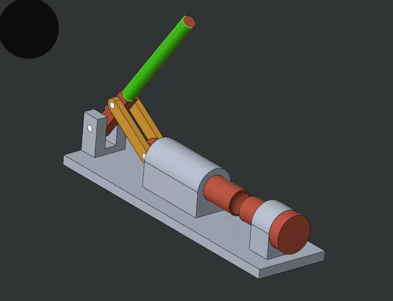

# Nutcracker-Mechanism-Assembly

  

---

Description
Parametric mechanical assembly demonstrating a crank-driven piston compression system.

## Degrees of Freedom
- Revolute joints at hinge connections
- Linear motion of piston
- Constrained base

## CAD Platform
PTC Creo

## Skills Demonstrated
- Assembly constraint logic
- Revolute & sliding mates
- Part modularity
- Clean part hierarchy
- Parametric geometry

## Components
- Base
- Cylinder
- Piston
- Handle
- Hinge Links
- Pins
